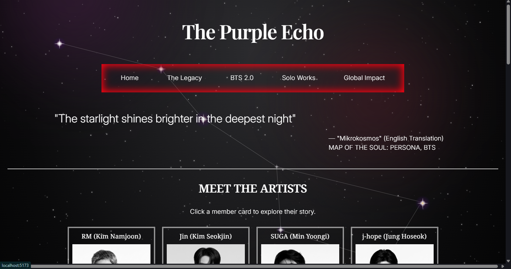
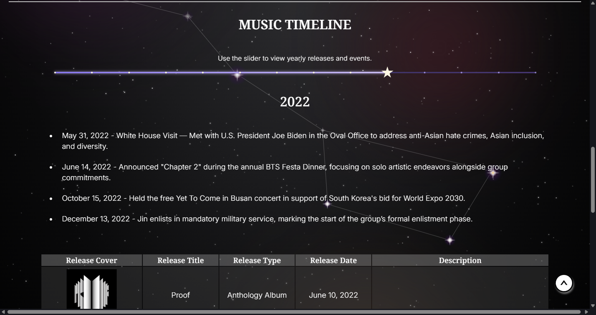

# The Purple Echo - Documentation

## Redevelopment Plans

<table>
    <thead>
        <tr>
            <th>Aspect</th>
            <th>Version 1</th>
            <th>Version 2</th>
        </tr>
    </thead>
    <tbody>
        <tr>
            <td>Frontend</td>
            <td>HTML/CSS/JS</td>
            <td>React</td>
        </tr>
        <tr>
            <td>Backend</td>
            <td>Python Flask + SQLAlchemy</td>
            <td>Static React (tentative)</td>
        </tr>
        <tr>
            <td>Data</td>
            <td>SQLAlchemy models</td>
            <td>JavaScript data files</td>
        </tr>
        <tr>
            <td>Theme</td>
            <td>Love Yourself: Answer</td>
            <td>Arirang inspired constellation theme</td>
        </tr>
        <tr>
            <td>Navigation Bar</td>
            <td>Basic nav bar</td>
            <td>Interactive nav bar with dropdown menu and hover animation</td>
        </tr>
        <tr>
            <td>Member Cards</td>
            <td>Basic cards</td>
            <td>Interactive modal with detailed profiles</td>
        </tr>
        <tr>
            <td>Discography</td>
            <td>Albums</td>
            <td>Albums, songs, solo career, embedded media</td>
        </tr>
    </tbody>
</table>

## Data Architecture 
- Organized member information into structured JavaScript objects.
- Separated application data from UI components.
- Utilized nested arrays and objects to represent:
  - General information
  - Discography
  - Awards (categorized by featured, selected, and unfeatured items)
  - Achievements
  - Philanthropic activities
  - Brand partnerships
  - Image collections
- Rendered data dynamically using `.map()`.
- Designed the data structure to simplify future migration to a backend or API.
- Implemented multi-tier data filtering and sorting within local components to process raw data objects into categorized structures (e.g., separating featured, selected, and remaining awards arrays dynamically). 
- Integrated client-side utility functions (e.g., `calculateAge`) inside static data definitions to preserve atomic state updates and guarantee chronological data accuracy without redundant component calculations.
- Utilized modern JavaScript features like `Array.prototype.toSorted()` to maintain immutability and prevent unintended data mutation across component rerenders. 

## Routing
- Leveraged `react-router-dom` (`BrowserRouter`, `Routes`, `Route`) to build a single-page application (SPA) with instant client-side view changes.
- **Hierarchical URL Taxonomy:** Structured semantic pathing to support distinct logical boundaries across the site layout:
  - **Core Spaces:** Base entrypoints mapping directly to unified index views (`/`, `/the-legacy`, `/solo-works`, `/global-impact`).
  - **Nested Era Views:** Sub-routing paths (`/solo-works/:member` and `/bts-2point0/arirang`) to handle deep-linking states for multi-layered conceptual eras.
- Structured the `BrowserRouter` tree to inject persistent navigational scaffolds (`<NavBar />`) globally across view updates, limiting unmount re-renders to target route entry boundaries.

## Components
 
### MemberCardHomePage
- A lightweight presentational component used on the homepage to preview each BTS member.
- Receives a single `member` object as a prop and renders the member name, image, and a short call-to-action label.
- Keeps the homepage UI simple and consistent while acting as a visual entry point into the richer member modal experience.
- Styled through the dedicated card stylesheet to maintain the constellation-themed visual language.

### MemberModal

- Implemented a reusable modal component to display detailed information for each BTS member.
- Dynamically renders member information from structured JavaScript data objects instead of hardcoded JSX.
- Uses a React Portal (`createPortal`) to render the modal outside the normal component hierarchy, preventing stacking and overflow issues.
- Implemented backdrop overlay with modal focus to improve user experience.
- Prevented accidental modal closure using `event.stopPropagation()`, ensuring clicks inside the modal do not propagate to the backdrop.
- Restricted scrolling to the modal container while preventing background page scrolling.
- Added fade-in animations and smooth transitions.

### Carousel
- A reusable image carousel component for displaying collections of member-related images across sections such as discography, philanthropy, and endorsements.
- Maintains its own `currentIndex` state and auto-advances every few seconds when the user isn't hovering over the carousel.
- Supports manual navigation via left/right controls.
- Uses a horizontal sliding track with CSS transforms for smooth animation between images.
- Displays images dynamically pulled from the member data structure.

### ExpandableText
- A helper component used inside the member modal to present large blocks of text or tabular content in a compact way.
- Implements Show More / Show Less functionality, supporting expandable list and table layouts for long datasets.
- Uses local state to track whether the content is expanded.
- Automatically scrolls back to the beginning of the section (repositioning the modal viewport) when collapsing, so users stay oriented.

### ScrollReveal
- A wrapper component that reveals sections gradually as they enter the viewport.
- Uses the `IntersectionObserver` API to detect when a section becomes visible while scrolling inside the modal.
- Adds a subtle reveal effect to improve pacing and readability of long member profiles.

### ScrollTop
- A floating "Scroll to Top" button component that returns the active container or window to the top.
- Detects scroll position and toggles its own visibility based on how far the user has scrolled down the page or modal.
- Improves navigation and accessibility within lengthy member profiles.  

### MusicTimeline

- A home-page feature that lets users explore BTS releases and major events year by year through an interactive slider, built with React and Material UI's `Slider` component.
- Tracks the selected year in local state (`activeYear`, range 2013-2026) and looks up the matching year's data from the `musicTimeline` data file via `.find()`.
- Renders a list of major events and a table of album releases (cover image, title, type, date, description) for the active year; each section only renders when data exists for that year.
- The content area fades in on year change, using `key={activeYear}` to remount the display div and retrigger the `fadeInYear` CSS animation.
- Styled with a dark violet gradient rail/track, a star-shaped thumb (CSS `clip-path`) that spins continuously on hover/focus/active, and dot-style marks along the track for each year.
- Styling lives in `MusicTimeline.css`, following the constellation theme (glowing highlights, soft white accents, celestial visual language).
- **Planned improvements:** smoother keyboard accessibility for the slider, better mobile responsiveness for the table layout, richer year summaries or visual markers for major milestones.

### NavBar
- A route-based navigation bar built with React Router and `NavLink`.
- Contains grouped navigation links for Home, The Legacy, BTS 2.0, Solo Works, and Global Impact.
- Uses hover state to reveal dropdown menus for sections that contain nested routes.
- Keeps navigation consistent across the single-page app without reloading the page.

### SpaceBackground
- A full-screen animated background system that creates the site's outer-space atmosphere.
- Renders multiple layers: a base layer, a textured dust layer, a constellation layer, a filler star layer, and the main UI layer.
- Uses a Big Dipper-inspired constellation composed of glowing star points and connecting lines.
- Generates a large number of filler stars dynamically through a helper utility module to create a dense, twinkling sky.
- Applies smooth parallax-like motion during scroll and responds to window resizing through animation-frame-based updates.
- Serves as the visual foundation for the rest of the interface and reinforces the project's celestial theme.
- *(Full layer breakdown lives in the [Home Page Background](#home-page-background) section below.)*

## Features
- **Dynamic Popup Biographies:** Allows users to interact with individual artist cards to bring up structured modal profiles without leaving the main homepage context.

- **Automated Age Calculations:** Integrates real-time date utility formulas to display current ages accurately based on birthday timestamps.

- **Interactive Multi-Category Tables:** Dynamically segments and displays large blocks of text data, such as records and brand ambassadorships, into clean, sortable row designs.

- **Interactive Data Truncation Engine (`ExpandableText`):** Implemented contextual limits for heavy tabular data and text blocks. The module keeps initial data footprints light, tracks historical toggle state, and runs smooth-scroll window adjustments back to target section offsets upon text collapse.
- **Viewport-Triggered Transition System (`ScrollReveal`):** Integrated an event-free layout tracking mechanism relying entirely on the native modern `IntersectionObserver` API to gracefully introduce layout rows asynchronously upon scroll entry.
- **Contextual State-Restoration Navigation:** Built an independent window tracker module (`ScrollTop`) bound natively to custom viewport wrapper element references (`modalRef`), introducing floating control patterns designed to resolve extensive manual scroll exhaustion inside extended member files.

## Libraries 
- `react-router-dom` - Client-side routing
- `react-dom` - Used for DOM-specific injections, specifically mounting overlays via React Portals (`createPortal`).
- `react-icons` - Consistent iconography across the application

## UI/UX
### Styling
- Designed the interface using Flexbox-based layouts.
- Utilized CSS transitions and animations to create smooth interactions.
- Applied custom styling for tables, cards, overlays, and modal layouts.
- Designed a responsive modal with independent scrolling. 
- Isolated pointer click interactions within child modal interfaces through deliberate `event.stopPropagation()` calls, establishing structured hit-target zones that eliminate unintended backdrop triggers.
- Used layered backgrounds, gradients, shadows, and hover effects to improve visual hierarchy. 
- Applied structural column constraints via CSS element selection parameters alongside zebra-striping table properties to make dense data matrices scannable. 
- **Constellation Background System:** A custom CSS/JS canvas background featuring a twinkling Big Dipper constellation animation. (this is done, i need to shift this)

### HTML Semantics 
- Used semantic HTML elements such as `<section>`, `<article>`, `<header>`, and `<main>` where appropriate.
- Improved document structure and readability.
- Established a stronger foundation for accessibility and search engine optimization.

## Accessibility
- **Background Scroll Locking:** Programmatically disabled global document scrolling while the portal modal layout is active, preventing background positioning shifts for layout clarity.

- **Visual Hierarchy and Readability:** Implemented predictable spatial typography rules along with zebra-striping on dense data tables to reduce cognitive load.

- **Semantic Landmark Architecture:** Structured the layout container hierarchies using explicit semantic landmark wrappers (`<article>`, `<section>`, `<thead>`, `<tbody>`) to establish logical reading structures for assistive technologies (screen readers).

- **Clear Text Alternatives:** Enforced descriptive contextual data hooks for image tags (`alt={member.stageName}`) to guarantee informational parity when graphic layouts fail to download or scale.

## Performance 
- Utilized React's list rendering for efficient dynamic content generation.
- Minimized duplicate JSX through reusable components. 

## Future Improvements
### Interactive Features 
- **Interactive Global Impact Map:** A visual world map tracking official global stadium tours alongside notable historic milestones (e.g., UN General Assembly speeches, White House visits).

### UI & Aesthetics
- **Theme Redesign:** Visual overhauls inspired by cultural motifs and the group's performance stylings ("Arirang").

### Engineering & Optimization
- Keyboard accessibility
- ESC key to close modal
- Image lazy loading
- Responsive layout improvements
- Individual member pages
- Dynamic discography pages

---------------------